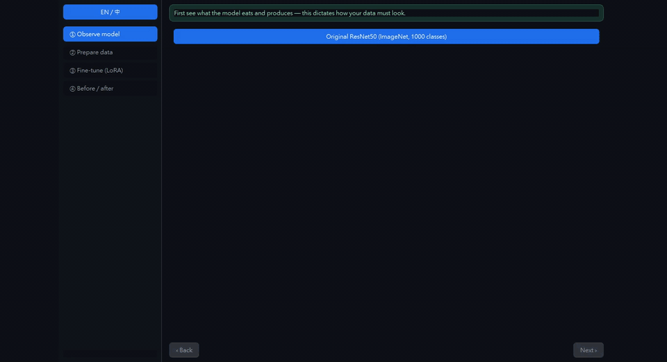
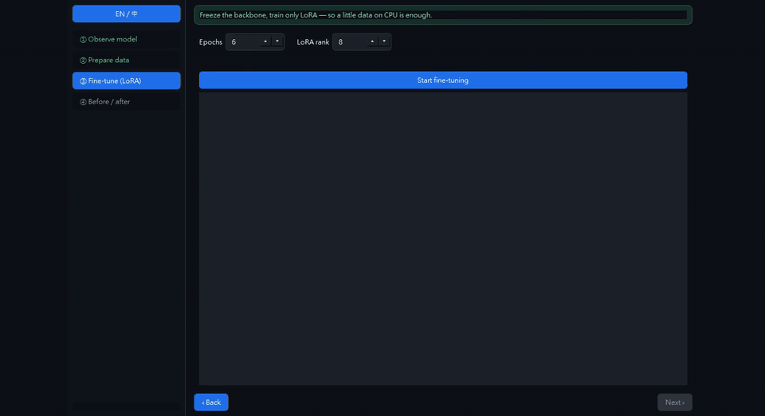
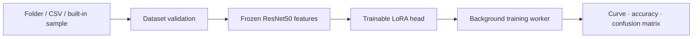

# VisionDesk

**Fine-tune a vision model on your own classes—locally, on CPU, with the trainable surface made visible.**

[Desktop release](https://github.com/RemyJerrie1/VisionDesk/releases/tag/v0.1.0) · [繁體中文](README.zh-TW.md)

[](https://github.com/RemyJerrie1/VisionDesk/actions/workflows/ci.yml)   

<a href="./docs/media/system-workflow.mp4"></a>

This is the real VisionDesk window driven by the real core pipeline. The camera stays fixed; there is no zoom animation or mock dashboard.

## What the run demonstrates

| Evidence | Captured result |
| --- | --- |
| Frozen ResNet50 backbone | 23,528,530 total parameters |
| Tiny adaptation surface | 16,400 trainable parameters—0.0697% |
| Real local training | 8 CPU epochs on the reproducible built-in dataset |
| Measured improvement | validation accuracy 0.4375 → 0.8125 |
| Privacy boundary | images and model work stay on the machine |

The bundled dataset is deliberately small and educational. These numbers demonstrate that the workflow learns; they are not presented as a production benchmark. See the [machine-readable runtime evidence](docs/media/runtime-evidence.json).

## Runtime walkthroughs

### 1. Observe the model and prepare data

<a href="./docs/media/data-workflow.mp4"></a>

- Inspect the ResNet50 input, normalization, output shape, and parameter count.
- Choose the built-in sample, an ImageFolder layout, or a CSV with `path,label`.
- Preview class counts and surface demo-scale warnings before training.

### 2. Fine-tune and compare

<a href="./docs/media/training-results.mp4"></a>

- Configure epoch count and LoRA rank.
- Train off the UI thread while loss and validation accuracy update.
- Compare before/after accuracy and inspect the confusion matrix.

## Design system

The desktop UI and matplotlib charts now share semantic tokens instead of maintaining unrelated color constants:

```text
app/design_system/
├── tokens.py      color, spacing, and radius roles
├── theme.py       Qt component states and shared stylesheet
└── __init__.py    public design-system boundary
```

The production window consumes `APP_STYLESHEET`; charts consume the same `COLORS` contract. `tests/test_design_system.py` prevents required roles from silently drifting.

## Architecture



| Boundary | Responsibility |
| --- | --- |
| `core/` | LoRA math, datasets, validation, model loading, training, evaluation |
| `app/controller.py` | UI-free orchestration and typed results |
| `app/worker.py` | non-blocking Qt worker lifecycle |
| `app/main_window.py` | guided four-step product flow |
| `app/design_system/` | shared semantic visual contract |
| `tests/` | math, dataset, learning, and design-system regression |

> **Why there is no Bruno collection:** VisionDesk is a native desktop application with no HTTP API. Adding an empty collection would misrepresent the architecture. Pytest contracts, the packaged `--smoke` path, and the reproducible runtime capture are the executable evidence instead.

## Run locally

```powershell
python -m venv .venv
.venv\Scripts\python.exe -m pip install -r requirements-dev.txt
.venv\Scripts\python.exe -m app
```

Verification:

```powershell
.venv\Scripts\python.exe -m app --smoke
.venv\Scripts\python.exe -m pytest -q
.venv\Scripts\python.exe -m ruff check .
.venv\Scripts\python.exe -m mypy core app
```

<details>
<summary><strong>Engineering decisions</strong></summary>

- **Hand-rolled LoRA:** the adapter is small, explainable, and unit-testable; a transformer-oriented dependency stack is unnecessary for one linear head.
- **Frozen backbone:** only the low-rank classifier adaptation trains, keeping CPU execution and the parameter percentage honest.
- **Pure core plus threaded UI:** model code remains Qt-free while long-running work stays off the main thread.
- **Learnable built-in sample:** class signal is deterministic and needs no download; real use can import ImageFolder or CSV data.
- **PySide6 packaging:** one codebase ships Windows and macOS desktop artifacts through CI.

</details>

<details>
<summary><strong>Current production boundary</strong></summary>

Phase 1 supports top-level ResNet50 feature transfer and classification. First model use downloads the official weights once. Domain-shifted datasets may require deeper adapters, GPU training, stronger augmentation, and benchmark-grade evaluation.

</details>

<sub>Python 3.13 · PyTorch · torchvision · NumPy · pandas · matplotlib · PySide6 · pytest · ruff · mypy</sub>
