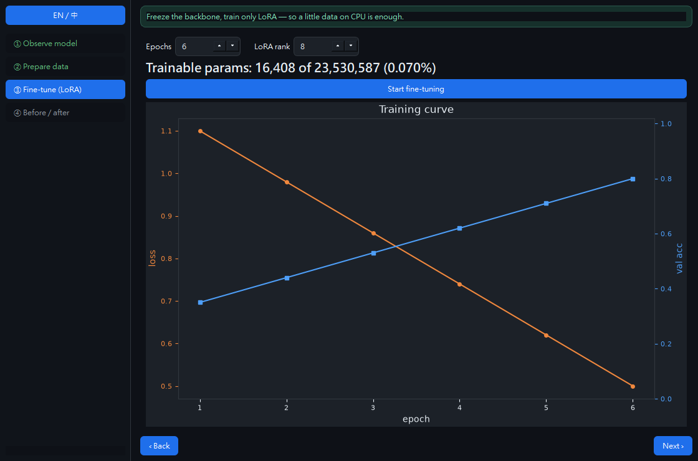
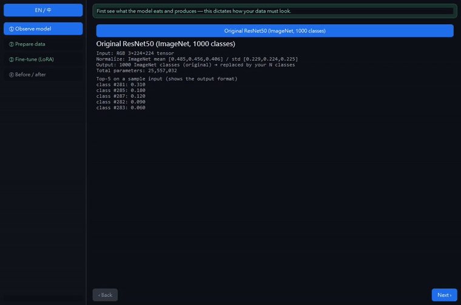

# VisionDesk

**English · [中文](README.zh-TW.md)**

> Native desktop app for **LoRA fine-tuning of ResNet50** — freeze the pretrained
> backbone, attach a tiny low-rank adapter, and teach it *your* classes on a
> laptop CPU. A guided 4-step flow (observe → prepare data → fine-tune → compare)
> makes transfer learning legible. 100% local, CPU-only, free (no GPU, no paid API).

**Status:** Phase 1 complete — core + desktop UI, tested, CI green, packaged Win/macOS ([Release v0.1.0](https://github.com/RemyJerrie1/VisionDesk/releases/tag/v0.1.0)).



<a href="./docs/media/product-walkthrough.mp4"></a>

## Business and engineering value

| Audience | What this demonstrates |
|---|---|
| Executive / product | A complex ML workflow reduced to a guided, understandable desktop experience with no cloud bill or data upload |
| Staff engineering | A clean separation between LoRA math, dataset validation, training, UI orchestration, and packaging |
| Hiring | Ownership across model adaptation, desktop UX, background work, testing, CI, and multi-platform release |

**Evidence boundary:** the app performs real local training on ResNet50 features. The bundled sample is intentionally small and educational; it is not presented as a production benchmark.

## Why it exists
Fine-tuning a vision model usually reads as "GPU, big dataset, someone else's script." VisionDesk shows the opposite: **freeze 23.5M backbone params, train ~16K LoRA params (0.070%)**, and a handful of images on CPU is enough to move accuracy on your own classes. Every step is on screen — what the model eats, how your data must look, what trains, and how much LoRA helped.

## The 4 steps
| Step | What you see |
|---|---|
| ① Observe model | ResNet50 input/output spec (3×224×224, ImageNet-normalized → 1000 classes) + top-5 on a sample input |
| ② Prepare data | built-in sample / import folder / import CSV — with an **always-on format-example panel** and a pandas preview (class counts, demo-scale warning) |
| ③ Fine-tune (LoRA) | epochs / rank controls, **trainable X of Y (%)** headline, live dual-axis training curve (loss + val-acc), trained off the UI thread |
| ④ Before / after | accuracy before (untrained head) vs after (+LoRA) + confusion matrix on your classes |

## Phase 1 — layout
```
core/lora.py      # hand-rolled LoRALinear: frozen base + trainable low-rank A/B (y = base(x) + xAᵀBᵀ·α/r)
core/modelzoo.py  # ResNet50 (IMAGENET1K_V2) load/freeze + LoRA head + top-k inference + input spec
core/dataset.py   # learnable synthetic sample (no download) + ImageFolder + CSV(path,label) loaders
core/train.py     # train the adapter only (Adam over trainable params) + evaluate + confusion
core/validate.py  # data guards (≥2 classes, non-empty) with plain-language errors
app/              # pure controller + QThread workers + matplotlib charts + i18n + 4-step window
tests/            # LoRA math, trainable <2%, dataset guards, real training (0.69 → 0.94 on synthetic)
```

## Run
```bash
python -m venv .venv && ./.venv/Scripts/python -m pip install -r requirements-dev.txt
./.venv/Scripts/python -m app            # launch the desktop app
./.venv/Scripts/python -m app --smoke    # headless self-check (offscreen, no download) → "smoke ok"
./.venv/Scripts/python -m pytest         # tests
```
> First real run downloads the ResNet50 weights (~100 MB, once); `--smoke` and the tests do not need them.

## Acceptance (Phase 1)
| # | Criterion | How to verify | Status |
|---|-----------|---------------|:--:|
| 1 | LoRA math correct | `pytest` — forward shape, base frozen / adapter trainable | ✅ |
| 2 | Adapter is tiny | `pytest` — trainable < 2% of total (3-class head = 0.070%) | ✅ |
| 3 | It actually learns | `pytest` — frozen ResNet50 + LoRA head goes 0.69 → 0.94 on the synthetic task | ✅ |
| 4 | Guided window, non-blocking | `python -m app` → observe → data → fine-tune (trains off the UI thread, live curve) → compare | ✅ |
| 5 | Data legibility | always-on folder/CSV format panel + pandas preview + demo-scale warning | ✅ |
| 6 | Installable app | PyInstaller `.exe`/`.app` via `build` workflow (`--smoke` per OS) | ✅ Win+macOS packaged on CI, per-OS `--smoke` passed, Release v0.1.0 published |

## Design decisions
- **Hand-rolled LoRA, not `peft`/`minlora`** — the adapter is a dozen lines (`y = base(x) + (x·Aᵀ·Bᵀ)·α/r`, `B` zero-init so training starts at the base), which keeps it explainable and unit-testable and drops a heavy Hugging Face dependency chain. `minlora` isn't on PyPI and `peft` is transformer-centric; for a single `Linear` head the DIY version is clearer. Counter-example: adapting many attention layers of an LLM → use `peft`.
- **Freeze the whole backbone, LoRA only the head (Phase 1)** — the pretrained ImageNet features transfer; training only the low-rank head is what makes CPU + little data viable and the trainable-% headline honest. Counter-example: a domain far from ImageNet (medical/satellite) → inject LoRA deeper into conv blocks (a later phase).
- **Learnable synthetic sample, colour-encoded** — the built-in dataset encodes class in image colour so the before/after accuracy story is *real signal*, not noise, and ships with zero download. Counter-example: a benchmark comparison → import a real folder/CSV.
- **Pure core + threaded UI** — all ML logic is Qt-free and unit-tested; the window only renders and runs training on a `QThread`, so it never freezes and the core stays testable. Counter-example: a one-off script → skip the split.

## Stack
Python · **PyTorch / torchvision (ResNet50)** · hand-rolled LoRA · numpy/pandas · matplotlib · PySide6 · pytest/ruff/mypy.

> Spec & roadmap: `MyExperience/作品藍圖/作品集/原生桌面/VisionDesk/` (Phase 2 = Grad-CAM explainability, Phase 3 = detection/YOLO).
